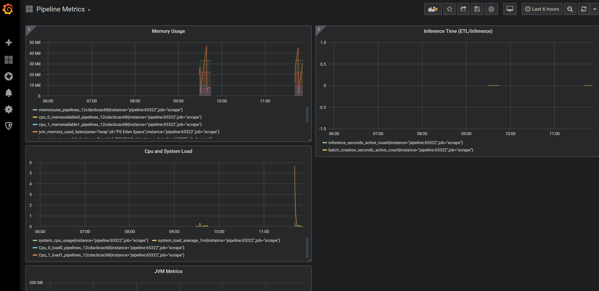

# Model monitoring with Konduit Serving

## Installation 

- **Konduit Serving**: Follow the installation steps available at https://serving.oss.konduit.ai/installation to build a Konduit Serving JAR file and install the `konduit` Python module.
- **Prometheus**: Download a [precompiled Prometheus binary](https://prometheus.io/download) for your OS architecture and unzip to a location on your local drive. 
- **Grafana**: Install Grafana from Grafana's [Downloads](https://grafana.com/grafana/download) page. See the [Grafana installation documentation](https://grafana.com/docs/grafana/latest/installation/) for platform-specific instructions. 

## Usage 

### Start Konduit server 

In this folder, run the following in a command line 

```bash
konduit serve --config ../../yaml/simple.yaml
```

### Start Prometheus server 

In this example, we use Prometheus to monitor the Konduit Serving instance. 

Copy the `prometheus.yml` file in this directory to the location of your Prometheus binary. Then, run:

```bash
./prometheus --config.file=prometheus_quickstart.yml
```

Omit the `./` if you're running Prometheus on `cmd.exe`. The `./` suffix is required on PowerShell. 

By default, Prometheus runs on port 9090. 

### Start Grafana server 

In this example, we use Grafana, which provides a dashboard to visualize data from the Prometheus instance. 

See the relevant Grafana installation instructions for your platform for instructions to start a Grafana service or, optionally, have Grafana initialize on startup. If you use the Windows installer to install Grafana, [NSSM](https://nssm.cc/) will run Grafana automatically at startup, and there is no need to initialize the Grafana server instance. 

In your browser, open`localhost:3000`. Login with the username `admin` and password `admin`. 

Next, add a Prometheus data source. Click on Add Data Source > Prometheus, then insert the HTTP URL http://localhost:9090 in the following page. 

On the bar on the left, mouse over on the + button, then click on Import.


Copy and paste the JSON in [dashboard.json](dashboard.json) into the import page as follows, then click the Load button:


On the next page, enter a name for your dashboard (such as **Pipeline Metrics**). Click the Import button:


Your Grafana dashboard will render on the next page. This dashboard contains metrics for system load and memory as well as timings for performing inference and ETL.



### Obtaining a prediction

Use the `predict-numpy` command:

```bash
konduit predict-numpy --config ../../yaml/simple.yaml --numpy_data ../../data/simple/input_arr.npy
```

### Stop server 

Remember to stop the Konduit Serving instance with 

```bash
konduit stop-server --config ../../yaml/simple.yaml
```

## References

- Grafana support for Prometheus:  https://prometheus.io/docs/visualization/grafana/